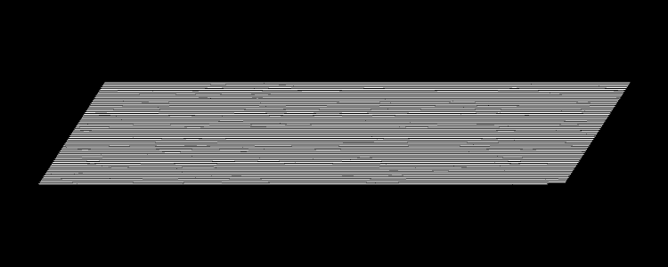

## Rutt/Etra Glitch

Inspired by the linear glitches by Rutt/Etra, this exploration uses perlin noise as data source:

This was made with https://openframeworks.cc.

To compile and execute the code on linux:

    make -j8 && make run

To generate the gif from the extracted pictures:

    convert -delay 3 screen*.png -loop 0 rutra.gif

Context: https://rtp.media.mit.edu/

